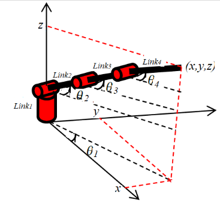

# Differential Evolution in Robotics
 Use of Differential Evolution to evaluate a 3D robotic system with several links

| Link | ![theta_i] | ![r_i] | ![d_i] | ![alpha_i] | ![theta_min] | ![theta_max] |
|:----:|:----------:|:----:|:----:|:------:|:-----:|:-----:|
|  01  | ![theta_1] | 0.00 | 0.03 |  +90°  |   0°  | +180° |
|  02  | ![theta_2] | 0.10 | 0.00 |  +90°  |   0°  | +180° |
|  03  | ![theta_3] | 0.10 | 0.00 |  +90°  | -180° |   0°  |
|  04  | ![theta_4] | 0.18 | 0.00 |  +90°  |  -90° |  +90° |

    [theta_i]: (http://latex.codecogs.com/gif.latex?\theta_i)
    [theta_1]: (http://latex.codecogs.com/gif.latex?\theta_1)
    [theta_2]: (http://latex.codecogs.com/gif.latex?\theta_2)
    [theta_3]: (http://latex.codecogs.com/gif.latex?\theta_3)
    [theta_4]: (http://latex.codecogs.com/gif.latex?\theta_4)

    [r_i]: (http://latex.codecogs.com/gif.latex?r_i)
    [d_i]: (http://latex.codecogs.com/gif.latex?d_i)
    [alpha_i]: (http://latex.codecogs.com/gif.latex?\alpha_i)
    [theta_min]: (http://latex.codecogs.com/gif.latex?\theta_{min})
    [theta_max]: (http://latex.codecogs.com/gif.latex?\theta_{max})
