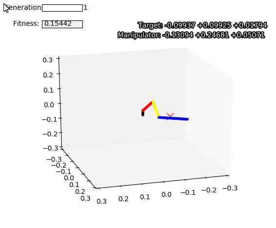
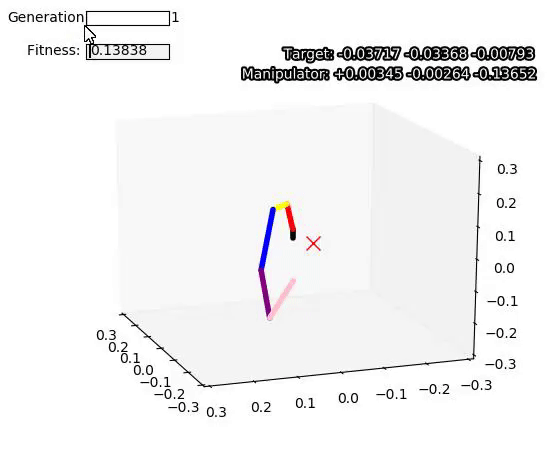

# Differential Evolution in Robotics
 Use of Differential Evolution to evaluate a 3D robotic system with several links

This implementation makes use of [Differential Evolution][DE] for the analysis of generic robotic systems in three-dimensional space, with its links described by [Denavit-Hartenberg parameters][DH]. The optimization (fitness function) takes into account the euclidean distance from the manipulator (extremity of last link) to a target point in space.

The implementation is generic enough to be able to optimize for any features of the system. For demonstration purposes, the only variable parameter is θ.

An example of a robotic system with four links is given below.


<center>
 
| Link | ![theta_i] | ![r_i] | ![d_i] | ![alpha_i] | ![theta_min] | ![theta_max] |
|:----:|:----------:|:----:|:----:|:------:|:-----:|:-----:|
|  01  | ![theta_1] | 0.00 | 0.03 |  +90°  |   0°  | +180° |
|  02  | ![theta_2] | 0.10 | 0.00 |  +90°  |   0°  | +180° |
|  03  | ![theta_3] | 0.10 | 0.00 |  +90°  | -180° |   0°  |
|  04  | ![theta_4] | 0.18 | 0.00 |  +90°  |  -90° |  +90° |

</center>

Example solutions for random targets, using the 4-link system described above, and another one with 2 more links added, for a total of 6 links:

<p align="center">
  
  
</p>

## Building and Running

First clone the repository and `cd` to it with

``` 
git clone github.com/gabrieljablonski/robotics-differential-evolution 
cd robotics-differential-evolution
```

The main source file is [`solveRoboticSystem.go`](src/solveRoboticSystem.go). Before running, you may want to make adjustments to the robotic system (`System.AddLinks()`), the target point, and the differential evolution parameters.

The program can the be built and run with

```
go run src/solveRoboticSystem.go [<output file>]
```

The optional `output file` parameter can be used to change the name of the output file containing the target and best agent for each generation. Make sure to run it from the same directory as the [`plot_link_generations.py`][plot_link_generations.py] script to be able to plot the results.


[DE]: https://en.wikipedia.org/wiki/Differential_evolution
[DH]: https://en.wikipedia.org/wiki/Denavit%E2%80%93Hartenberg_parameters

[theta_i]: http://latex.codecogs.com/gif.latex?\theta_i
[theta_1]: http://latex.codecogs.com/gif.latex?\theta_1
[theta_2]: http://latex.codecogs.com/gif.latex?\theta_2
[theta_3]: http://latex.codecogs.com/gif.latex?\theta_3
[theta_4]: http://latex.codecogs.com/gif.latex?\theta_4

[r_i]: http://latex.codecogs.com/gif.latex?r_i
[d_i]: http://latex.codecogs.com/gif.latex?d_i
[alpha_i]: http://latex.codecogs.com/gif.latex?\alpha_i
[theta_min]: http://latex.codecogs.com/gif.latex?\theta_{min}
[theta_max]: http://latex.codecogs.com/gif.latex?\theta_{max}
